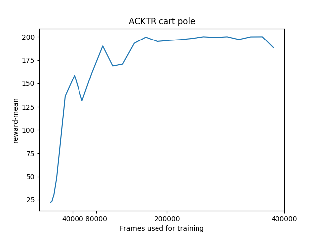

# Rainy
[](https://travis-ci.org/kngwyu/Rainy)

Reinforcement learning utilities and algrithm implementations using PyTorch.

# API documentation
COMING SOON

# Supported python version
Python >= 3.6.1

# Run examples
Though this project is still WIP, all examples are verified to work.

First, install [pipenv](https://pipenv.readthedocs.io/en/latest/).
E.g. you can install it via
``` bash
pip install pipenv --user
```

Then, clone this repository and create a virtual environment in it.
```bash
git clone https://github.com/kngwyu/Rainy.git
cd Rainy
pipenv --site-packages --three install
```

Now you are ready to start!

```bash
pipenv run python examples/acktr_cart_pole.py train
```

After training, you can run learned agents.

Please replace `(log-directory)` in the below command with your real log directory.
It should be named like `acktr_cart_pole-190219-134651-35a14601`.
``` bash
pipenv run python acktr_cart_pole.py eval (log-directory) --render
```

You can also plot training results in your log directory.
This command opens an ipython shell with your log file.
``` bash
pipenv run python -m rainy.ipython
```
Then you can plot training rewards via
```python
log = open_log('log-directory')
log.plot_reward(12 * 20, max_steps=int(4e5), title='ACKTR cart pole')
```


# Implemented Algorithms

## DQN (Deep Q Network)
- https://www.nature.com/articles/nature14236/

## DDQN (Double DQN)
- https://www.aaai.org/ocs/index.php/AAAI/AAAI16/paper/viewPaper/12389

## A2C (Advantage Actor Critic)
- http://proceedings.mlr.press/v48/mniha16.pdf , https://arxiv.org/abs/1602.01783 (A3C, original version)
- https://blog.openai.com/baselines-acktr-a2c/ (A2C, synchronized version)

## ACKTR (Actor Critic using Kronecker-Factored Trust Region)
- https://papers.nips.cc/paper/7112-scalable-trust-region-method-for-deep-reinforcement-learning-using-kronecker-factored-approximation

## PPO (Proximal Policy Optimization)
- https://arxiv.org/abs/1707.06347

# Implementaions I referenced
I referenced mainly openai baselines, but all these pacakages were useful.

Thanks!

https://github.com/openai/baselines

https://github.com/ikostrikov/pytorch-a2c-ppo-acktr

https://github.com/ShangtongZhang/DeepRL

https://github.com/chainer/chainerrl

https://github.com/Thrandis/EKFAC-pytorch (for ACKTR)

# License
This project is licensed under Apache License, Version 2.0
([LICENSE-APACHE](LICENSE) or http://www.apache.org/licenses/LICENSE-2.0).


